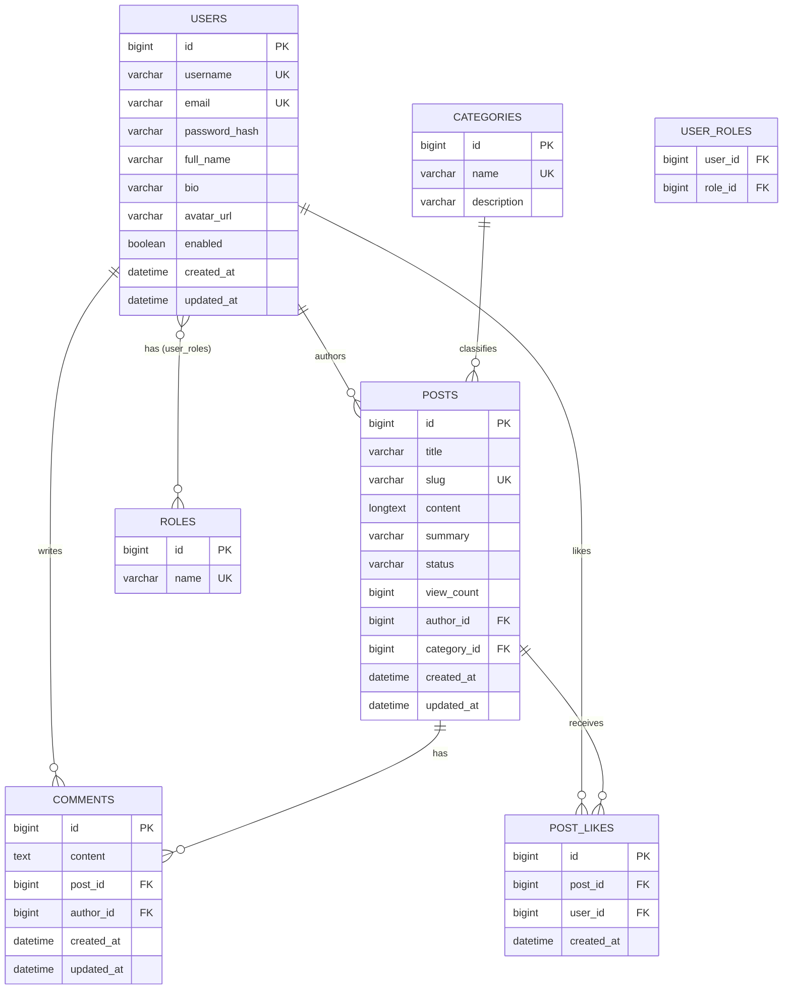

# Entity-Relationship Diagram

## Relationship summary

| Relationship | Type | Notes |
|---|---|---|
| User → Post | One-to-Many | `Post.author_id` FK; `cascade=ALL, orphanRemoval` from User |
| Category → Post | One-to-Many | `Post.category_id` FK; deleting a category is `RESTRICT`ed while posts reference it |
| Post → Comment | One-to-Many | `Comment.post_id` FK; cascades on post delete |
| User → Comment | One-to-Many | `Comment.author_id` FK |
| Post ↔ User (via PostLike) | Many-to-Many (join entity) | Modeled explicitly as `PostLike` (not `@ManyToMany`) so we can store `created_at` and enforce a unique `(post_id, user_id)` constraint against duplicate likes |
| User ↔ Role | Many-to-Many | Standard `@ManyToMany` with `user_roles` join table |
